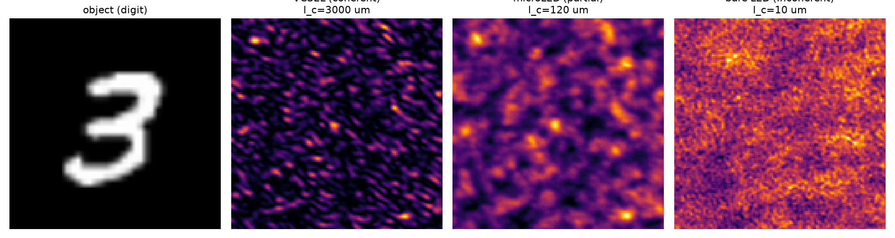

# One framework, every spatial-coherence regime

SVETlANNa models the **full coherence continuum** — from a single-mode laser to a bare LED —
in the *same* optical setup. Only the **source** changes; the geometry and code stay fixed.

| Source class | coherence length `l_c` | regime | representation |
|---|---|---|---|
| **VCSEL** (single-mode laser) | `l_c ≫` aperture | coherent | 1 coherent field |
| **microLED** | `l_c ~ few × S_F` | partial | Mercer coherent modes |
| **bare LED** | `l_c ≲ S_F` | incoherent | source-point / Monte-Carlo |

`S_F = 2λd/D` = finest feature the system preserves. The regime is set by `l_c / S_F`.

---

# Demo: an MNIST digit through a random-phase DOE

Same object, same diffuser, same propagation — **only the source coherence changes**.

*Geometry: 128² grid, 10 µm pixels, 1.28 mm aperture, λ = 550 nm, 5 cm propagation, random-phase DOE.*

---

# The framework captures the qualitative difference

Detector intensity vs source class (centered-cosine similarity to the coherent output):

| Source | `l_c` | regime (auto-classified) | output | similarity to coherent |
|---|---|---|---|---|
| VCSEL | 3000 µm | **coherent** | sharp **speckle** | 1.000 |
| microLED | 120 µm | **partial** | washed speckle | 0.637 |
| bare LED | 10 µm | **incoherent** | **smooth** | 0.043 |

- A non-imaging element (diffuser/DOE) makes the output **strongly coherence-dependent** —
  exactly the regime where neither the coherent nor incoherent approximation is valid.
- `coherence.assess(setup, source)` **auto-classifies** the regime and estimates cost + memory.
- The partial case (0.64) is *not* reproducible by either extreme — it must be modeled, and SVETlANNa does.

---

# Why it matters

- Real sources (LEDs, microLEDs, partially coherent lasers) are **never** perfectly coherent or incoherent.
- A diffractive network trained for the wrong coherence **fails** at deployment.
- SVETlANNa lets you **specify the source class** (VCSEL / microLED / LED via `l_c` or physical size + distance)
  and get the correct partially coherent physics — for both **inference and training**.

> One setup. One codebase. Lasers to LEDs.
